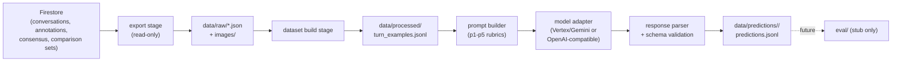

# PCK Feedback Research Pipeline — Plan

## Context gathered

- Live PCK feedback: `POST /api/pck-feedback` in [server/server.js](server/server.js) (lines ~367-909), calling Vertex AI Gemini (`gemini-2.5-flash-lite`) with a text-only prompt built from `formatScenarioContextForPrompt` (server.js:125-155), `formatSkillsForPrompt`/`formatConversationHistory` in [server/universal_pck_skills.js](server/universal_pck_skills.js). Board images are **not** sent to the PCK model today.
- Live skill IDs (`error-identification`, `error-characterization`, `diagnostic-interpretation`, `adapted-pedagogical-response`, `error-leveraging`) map 1:1 to annotation IDs `p1`-`p5` (from `PCK_SKILLS` in [src/config/testConfig.js](src/config/testConfig.js)). The research pipeline will standardize on `p1`-`p5`.
- Firestore collections in scope for export: `conversations`, `conversationAnnotationAssignments`, `conversationAnnotations`, `conversationConsensusAnnotations`, `annotationComparisonSets` (per user selection — full annotation lineage).
- Conversation `turns[]` shape (from [src/services/conversationLogger.js](src/services/conversationLogger.js):142-187): `teacher.message`, `teacher.image` (base64 PNG board drawing, may be null), `students[]`, `pckFeedback` (partial, live-only subset).
- Consensus annotation doc shape (`conversationConsensusAnnotations`) already defines per-turn `selectedDimensions` + `dimensionFeedback.{p1..p5}.{included,score,feedbackText}` — this becomes the ground-truth source for future eval.
- Repo is 100% Node/Express + React; no Python exists today. Per your decisions: **Python** for the new pipeline, **pluggable adapters** (Vertex/Gemini + OpenAI-compatible for future local/GPU vLLM/TGI serving), **no Anthropic-specific code**, **no hardcoded secrets**.

## Pipeline overview



## 1. Folder structure

```
research/pck_feedback/
  README.md
  pyproject.toml            # deps: firebase-admin, google-cloud-aiplatform (or google-genai), openai, pydantic, typer, pyyaml, python-dotenv, tenacity
  .env.example               # var names only, no secrets
  .gitignore                 # data/, .env, *.json creds, __pycache__
  config/
    export.yaml               # default collections/filters for export
    runs/
      baseline_gemini_text_only.yaml        # provider: vertex_gemini, no images, closest to production
      baseline_gemini_with_board_images.yaml # provider: vertex_gemini, include_board_images: true
      baseline_openai_compat.yaml            # provider: openai_compatible, base_url, model
  src/pck_feedback/
    __init__.py
    schemas/
      raw.py                  # RawConversation, RawTurn, RawAnnotation, RawConsensusAnnotation, RawComparisonSet (pydantic, extra="allow")
      turn_example.py         # TurnExample
      prediction.py           # Prediction, DimensionResult
    pck_skills.py             # ported p1-p5 rubric data (from universal_pck_skills.js) + id mapping table + RUBRIC_VERSION
    firestore_client.py       # read-only Firestore client init (firebase-admin, cred from env var)
    export/
      export_collections.py   # dumps each collection to data/raw/<collection>/<docId>.json + manifest.json (raw JSON kept byte-faithful to Firestore, including base64 images)
      extract_images.py       # pulls turn.teacher.image base64 -> data/raw/images/<sessionId>/<turnNumber>.png (additive only, does not mutate raw JSON)
    dataset/
      build_turn_dataset.py   # joins conversations + consensus -> TurnExample JSONL; supports --comparison-set-id / --only-completed-consensus filtering
      context_builder.py      # assembles history/scenario/student/image context per turn
    prompts/
      baseline_prompt.py       # ports formatScenarioContextForPrompt/formatSkillsForPrompt/formatConversationHistory
      registry.py              # prompt_version -> builder fn
    models/
      base.py                  # ModelAdapter ABC: complete(prompt_payload, gen_config) -> raw text
      vertex_gemini.py          # Vertex AI adapter
      openai_compatible.py      # OpenAI SDK pointed at configurable base_url (covers OpenAI, vLLM, TGI)
      registry.py               # provider string -> adapter factory
    inference/
      parsing.py                # raw text -> Prediction, with defaulting/repair logic mirroring server.js:837-896
      run_inference.py          # dataset -> prompt -> adapter -> parse -> predictions.jsonl; skips (run_id, example_id) pairs already present in the output file (resume support)
    eval/
      README.md                 # stub: "not implemented yet, see plan"
    training/
      README.md                 # stub: "not implemented yet — explicitly out of scope"
    cli/
      main.py                   # typer app: export, build-dataset, infer
  data/                        # gitignored, created at runtime
    raw/{conversations,annotation_assignments,annotations,consensus_annotations,comparison_sets,images}/
    processed/turn_examples.jsonl
    predictions/<run_id>/predictions.jsonl
  tests/
    fixtures/sample_conversation.json, sample_consensus.json
    test_context_builder.py
    test_prompt_builder.py
    test_parsing.py
```

## 2. Data schemas

### Raw export (`schemas/raw.py`)
Mirrors Firestore docs closely (pydantic `extra="allow"` so unknown fields don't break ingestion):
- `RawConversation`: `sessionId, userId, userSnapshot, systemVersion, startTime, endTime, scenario, studentRefs, turns[RawTurn], stats, summaryFeedback`
- `RawTurn`: `turnNumber, timestamp, teacher{message, image, timestamp}, students[{name,message,timestamp}], pckFeedback|null`
- `RawAnnotationAssignment`: `assignmentId, conversationId, annotatorId, assignmentType, status, createdBy, createdAt, updatedAt, completedAt`
- `RawAnnotation`: `assignmentId, conversationId, annotatorId, assignmentType, feedbackPoints[], generalComment, status, createdAt, updatedAt, submittedAt`
- `RawConsensusAnnotation`: `consensusId, comparisonSetId, conversationId, sourceAssignmentIds, status, feedbackPoints[{turnNumber, teacherMessageSnapshot, selectedDimensions, dimensionFeedback:{p1..p5:{included,score,feedbackText}}}]`
- `RawComparisonSet`: `id, items[{conversationId, assignmentIds}], visibleToAnnotators`

### Turn-level example (`schemas/turn_example.py`)
```python
class TurnExample(BaseModel):
    example_id: str                 # f"{conversation_id}__{turn_number}"
    conversation_id: str             # canonical join key for annotations/consensus (== conversations doc ID)
    session_id: str                  # the conversation document's own session/id field, kept separately;
                                      # only ever used if it is the actual identifier from the conversation doc
                                      # (prevents ID-mismatch bugs if these two ever diverge for a given record)
    turn_number: int
    scenario: dict                  # text, grade_level, ai_context_summary, ai_prior_knowledge,
                                     # ai_pedagogical_focus, misconception_focus, target_pck_skills
    student_info: list[dict] = []   # best-effort, from a local persona reference file (see risk below)
    conversation_history: list[dict]  # [{turn_number, teacher_message, student_messages: [str]}]
    teacher_message: str
    board_image_path: str | None    # relative path under data/raw/images/, not inline base64
    ground_truth: dict | None       # see "Ground truth semantics" below
    source: dict                    # {raw_conversation_file, raw_consensus_file|null, exported_at}
```

#### Ground truth semantics (explicit, not inferred)

- `ground_truth = None` **only** means: this conversation has **no completed** consensus annotation document at all (nothing to compare against — the example is inference-only).
- If a completed consensus annotation **does** exist for the conversation, then **every** teacher turn in that conversation gets a non-null `ground_truth`:
  - If the turn's `turnNumber` appears in the consensus `feedbackPoints`: `ground_truth = {"has_feedback": true, "dimensions": {p1: {included, score, feedbackText}, ...}}` (missing dims among p1-p5 filled as `{"included": false}`).
  - If the turn's `turnNumber` does **not** appear in the consensus `feedbackPoints`: `ground_truth = {"has_feedback": false, "dimensions": {p1: {"included": false}, p2: {"included": false}, p3: {"included": false}, p4: {"included": false}, p5: {"included": false}}}` — an explicit negative label, never `null`.
- This makes "no feedback needed" a first-class labeled outcome instead of a missing value, which is required for computing precision/recall on `should_provide_feedback` later.

### Model prediction (`schemas/prediction.py`)
```python
class DimensionResult(BaseModel):
    relevant: bool
    score: int | None        # 0,1,2 or None if not relevant
    feedback_text: str | None

class Prediction(BaseModel):
    example_id: str
    conversation_id: str
    session_id: str
    turn_number: int
    run_id: str
    model_provider: str        # "vertex_gemini" | "openai_compatible"
    model_name: str
    prompt_version: str
    rubric_version: str         # from pck_skills.RUBRIC_VERSION at run time — reproducibility of scoring criteria
    created_at: str
    should_provide_feedback: bool
    dimensions: dict[str, DimensionResult]   # keys: p1..p5
    feedback_text_overall: str | None
    raw_model_output: str
    parse_status: str          # "ok" | "repaired" | "failed"
    parse_error: str | None
    latency_ms: float | None
```
This schema is identical for baseline and any future fine-tuned model, so `eval/` (later) can compare any two prediction files against the same `ground_truth` in `TurnExample`. `rubric_version` + `prompt_version` + `run_id` together pin down exactly which scoring criteria and prompt produced a given prediction file, so results stay comparable/reproducible across experiments even as `pck_skills.py` evolves.

## 3. Firestore export strategy

- New file [research/pck_feedback/src/pck_feedback/firestore_client.py](research/pck_feedback/src/pck_feedback/firestore_client.py): initializes `firebase-admin` (Python) using `credentials.Certificate(os.environ["PCK_RESEARCH_GOOGLE_APPLICATION_CREDENTIALS"])` — a **dedicated env var name**, distinct from the server's, to avoid any accidental coupling. Documented in `.env.example`. Read-only usage only (never `.set/.update/.add/.delete`).
- `export/export_collections.py` reads each of the 5 collections above with optional filters (`--since <ISO date>`, `--session-ids a,b,c`, `--limit`), and writes one JSON file per document to `data/raw/<collection>/<docId>.json`. **These raw files are a byte-faithful copy of the Firestore document** — including the inline base64 `teacher.image` blobs. Nothing is stripped from the raw export; it stays a trustworthy source of truth that can be re-derived from at any time.
- `export/extract_images.py` is purely **additive**: it walks the already-exported raw conversation files, decodes `turn.teacher.image` base64, and writes PNG files under `data/raw/images/<sessionId>/<turnNumber>.png` plus an `images_manifest.json` (`{sessionId, turnNumber, path, sizeBytes}` per image). It does **not** modify or slim down the raw conversation JSON. Any slimmer/downstream copy (e.g. for the dataset build step, which only needs the path, not the blob) is a separate derived file under `data/processed/`, never a mutation of `data/raw/`.
- Writes `data/raw/export_manifest.json`: `{exported_at, collections, filters, doc_counts, pipeline_git_sha}` for reproducibility.
- Incremental by default: skip re-writing a doc file if local `updatedAt`/`lastUpdated` matches the fetched one; `--force` to overwrite.
- No writes back to Firestore anywhere in this stage.

## 4. Turn-level dataset build

`dataset/build_turn_dataset.py`:
1. Load all `RawConversation` files. `conversation_id` = the Firestore document ID (= `conversations/{sessionId}` doc ID) — this is the canonical key used everywhere for joining with `conversationAnnotations` / `conversationConsensusAnnotations` (`conversationId` field on those docs). `session_id` is copied from the conversation document's own `sessionId` field verbatim and carried through for traceability, but is **never** used as the join key — this avoids bugs if a doc ID and its internal `sessionId` field were ever to diverge.
2. For each `turn` where `teacher.message` is non-empty, build a `TurnExample`:
   - `conversation_history` = all prior turns in that session (teacher + student messages), text-only — mirrors `formatConversationHistory` logic.
   - `board_image_path` = resolved path from `extract_images.py`'s `images_manifest.json`, if present.
   - `student_info` = best-effort lookup from a **local static reference file** `config/student_personas_reference.json` (ported once from [src/config/students/personas.js](src/config/students/personas.js), since personas are not stored in Firestore) keyed by `studentRefs`; if not found, empty list — never fails the build.
3. Join ground truth by `conversation_id`:
   - Find a `RawConsensusAnnotation` with matching `conversationId` and `status == "completed"`.
   - If **no** such consensus doc exists: `ground_truth = None` for every turn in that conversation (inference-only).
   - If a completed consensus doc **does** exist: every turn in that conversation gets an explicit `ground_truth` (never `None`) — either the matched `feedbackPoints` entry (`has_feedback: true`) or an explicit all-`included: false` negative label (`has_feedback: false`) when the turn is absent from `feedbackPoints`. See "Ground truth semantics" above.
4. Support dataset-scoping filters (CLI flags, also settable via a build config file):
   - `--comparison-set-id <id>`: only include conversations that appear in the given `annotationComparisonSets` doc's `items[]`.
   - `--only-completed-consensus`: only include conversations that have a `conversationConsensusAnnotations` doc with `status == "completed"`. This is how the first eval-ready test set (the 5 completed consensus conversations) gets built: `build-dataset --only-completed-consensus --out data/processed/test_set_v1.jsonl`.
   - Both flags can be combined; omitting both keeps the current "all exported conversations" behavior for inference-only dataset builds.
5. Write `data/processed/turn_examples.jsonl` (one `TurnExample` per line).

## 5. Prompt builder strategy

- `pck_skills.py`: ports the 5 rubric entries from `universal_pck_skills.js` verbatim (Hebrew patterns, score 0/1/2 descriptions), keyed by `p1`-`p5` via this fixed mapping. The module defines a top-level `RUBRIC_VERSION = "v1"` constant (bump manually whenever rubric text/mapping changes). Every prediction written by `run_inference.py` records the `RUBRIC_VERSION` active at run time in `Prediction.rubric_version`, independent of `prompt_version` — this lets future experiments distinguish "prompt changed" from "underlying rubric changed" when comparing runs.

| Research ID | Production `skill_id` |
|---|---|
| p1 | error-identification |
| p2 | error-characterization |
| p3 | diagnostic-interpretation |
| p4 | adapted-pedagogical-response |
| p5 | error-leveraging |

- `prompts/baseline_prompt.py` builds the prompt from a `TurnExample`, mirroring production structure section-by-section:
  - Scenario block ≈ `formatScenarioContextForPrompt` (server.js:125-155).
  - Skills/rubric block ≈ `formatSkillsForPrompt`, but emitting `p1`-`p5` labels.
  - History block ≈ `formatConversationHistory` (`מורה: ...` / `{name}: ...`).
  - Teacher's current message, quoted.
  - New (config-gated, off by default to match production baseline): student persona block, and board image attached as a separate multimodal part if `include_board_images: true` in the run config **and** the adapter supports vision.
  - Requests strict JSON output with `should_provide_feedback` + per-dimension `relevant/score/feedback_text` fields (matching `Prediction` schema, not production's full internal JSON).
- `prompts/registry.py` maps a `prompt_version` string (e.g. `"baseline_v1"`) to a builder function, so future prompt variants can be added without touching run configs' other fields.

## 6. Model adapter interface

`models/base.py`:
```python
class ModelAdapter(ABC):
    @abstractmethod
    def complete(self, prompt_payload: PromptPayload, gen_config: dict) -> RawCompletion:
        """Returns raw text + optional usage/latency metadata. No parsing here."""
```
- `models/vertex_gemini.py`: uses the Vertex AI Python SDK, credentials from `GOOGLE_APPLICATION_CREDENTIALS` (or a dedicated research var), `project`/`location`/`model` from run config (defaults mirror production: `gemini-2.5-flash-lite`, but overridable). Supports optional image parts when `include_board_images` is set.
- `models/openai_compatible.py`: uses the `openai` Python SDK with configurable `base_url` + `api_key` (from env var name specified in config, never hardcoded) — this single adapter covers OpenAI itself **and** any self-hosted OpenAI-compatible server (vLLM, TGI, Ollama) for future local GPU models. No Anthropic-specific code.
- `models/registry.py`: `get_adapter(run_config) -> ModelAdapter` factory keyed on `run_config.provider`.
- `inference/parsing.py`: shared across adapters — extracts JSON (strips ```json fences like production does), validates against `Prediction`'s dimension fields, applies safe defaults on missing fields (mirrors server.js:837-896 defaulting), sets `parse_status`/`parse_error` instead of crashing the run on a bad response.

### Two baseline run configs

- `config/runs/baseline_gemini_text_only.yaml`: `provider: vertex_gemini`, `include_board_images: false`. Closest analogue to current production behavior (production never sends board images to the PCK model today).
- `config/runs/baseline_gemini_with_board_images.yaml`: `provider: vertex_gemini`, `include_board_images: true`. Attaches `board_image_path` (when present on a `TurnExample`) as a multimodal image part in the prompt — motivated by the fact that human annotators saw these images while producing the consensus ground truth, so this variant is expected to be the fairer comparison against human judgment.
- Both configs share the same `prompt_version` and rubric; only `include_board_images` (and whatever generation params are relevant) differ, so `run_id` naming should make the distinction obvious (e.g. `run_id: baseline_gemini_text_only_2026_07_22`).

### Resume / skip-existing support

- `run_inference.py` accepts `--out <predictions.jsonl>`. Before starting, if the file already exists, it reads all existing lines and builds a set of `(run_id, example_id)` pairs already present.
- For each `TurnExample` to process, if `(run_config.run_id, example.example_id)` is already in that set, the turn is skipped (no model call) and a debug log line is emitted.
- New predictions are appended, not rewritten — safe to re-run the same `infer` command repeatedly (e.g. after an API timeout or partial GPU run) without duplicating or re-billing already-completed turns. `--force-rerun` flag available to ignore existing results and overwrite from scratch.

## 7. CLI commands

`cli/main.py` (Typer app, installed as console-script `pck-research` or run via `python -m pck_feedback.cli`):
```
pck-research export        --config config/export.yaml [--since DATE] [--session-ids ...] [--force]

pck-research build-dataset --raw-dir data/raw --out data/processed/turn_examples.jsonl \
                            [--comparison-set-id <id>] [--only-completed-consensus]
# e.g. first eval-ready test set from the 5 completed consensus conversations:
pck-research build-dataset --raw-dir data/raw --only-completed-consensus \
                            --out data/processed/test_set_v1.jsonl

pck-research infer         --run-config config/runs/baseline_gemini_text_only.yaml \
                            --dataset data/processed/turn_examples.jsonl \
                            --out data/predictions/<run_id>/predictions.jsonl \
                            [--force-rerun]
# re-running the same command resumes/skips (run_id, example_id) pairs already in --out

pck-research evaluate      # stub: prints "not implemented yet" and exits — placeholder for future stage
```

## 8. Isolation from production

- Entirely new directory `research/pck_feedback/`; zero imports from `src/` or `server/` (different language/runtime already guarantees this).
- Own `pyproject.toml`/venv — does not touch root `package.json` or `server/package.json`.
- Credentials via dedicated env vars documented in `.env.example` (no defaulting to `server/service-account-key.json` path in code — user supplies their own path; recommend a **read-only** IAM service account for this pipeline).
- No Firestore writes anywhere in this stage (export and inference are read + local-file-write only) — enforced by code review convention: no `.set(`/`.update(`/`.add(`/`.delete(` calls in the package.
- All generated data lives under `research/pck_feedback/data/` (gitignored); nothing is written under `src/`, `server/`, or `public/`.
- No changes to `Router.js`, `NavBar.jsx`, `server.js`, or any existing route/page.
- README documents this is an offline, manually-run CLI tool, not part of the web app build/deploy.

## 9. Minimal first implementation steps

1. Scaffold folder structure, `pyproject.toml`, `.env.example`, `.gitignore`.
2. Implement `firestore_client.py` + `export_collections.py` (byte-faithful raw JSON) + `extract_images.py` (additive PNG extraction + `images_manifest.json`); verify against a couple of real conversation IDs.
3. Port `pck_skills.py` (p1-p5 rubric data + `RUBRIC_VERSION`) and `prompts/baseline_prompt.py`.
4. Implement `dataset/build_turn_dataset.py` — `conversation_id`/`session_id` handling, explicit ground-truth-for-every-turn logic, and `--comparison-set-id`/`--only-completed-consensus` filters (+ `student_personas_reference.json` one-time port). Use this to build the first `test_set_v1.jsonl` from the 5 completed consensus conversations.
5. Implement `models/base.py`, `vertex_gemini.py`, `openai_compatible.py`, `registry.py`, and shared `inference/parsing.py`.
6. Implement `inference/run_inference.py` (with resume/skip-existing by `(run_id, example_id)`) + wire up `cli/main.py` (`export`, `build-dataset`, `infer`). Add both `baseline_gemini_text_only.yaml` and `baseline_gemini_with_board_images.yaml` run configs.
7. Add stub `eval/README.md` and `training/README.md` (no logic).
8. Smoke-test end-to-end on the 5 completed-consensus conversations (and a few inference-only ones); write minimal tests under `tests/`, including a test asserting the "absent turn -> explicit negative ground truth" behavior.

## Open items / risks to flag in code comments

- Student persona data lives in JS source, not Firestore — handled via a one-time-ported static JSON reference file; must be manually re-synced if personas change.
- Board images inflate JSONL if inlined — solved by extracting to separate PNG files and referencing by path, while keeping the raw export itself byte-faithful (base64 preserved) so nothing is lost upstream of that derived step.
- Baseline prompt intentionally deviates from production (adds optional student-info/image context, uses p1-p5 instead of `skill_id` strings) — documented clearly as "baseline, not a byte-for-byte reproduction" in README.
- `conversation_id` vs `session_id`: always join on `conversation_id` (Firestore doc ID); `session_id` is carried for traceability only. If these two are ever observed to differ for a real record, that's a data-quality signal worth logging, not silently reconciling.
- Ground truth is explicit for every turn once a conversation has a completed consensus doc — absence from `feedbackPoints` is a labeled negative (`has_feedback: false`), not a missing value. `ground_truth = None` is reserved exclusively for "no completed consensus for this conversation at all."
- `RUBRIC_VERSION` (in `pck_skills.py`) and `prompt_version` (in `prompts/registry.py`) are bumped independently — a prompt wording tweak with the same rubric bumps only `prompt_version`; a rubric/mapping change bumps `RUBRIC_VERSION`. Both are stamped onto every `Prediction`.
